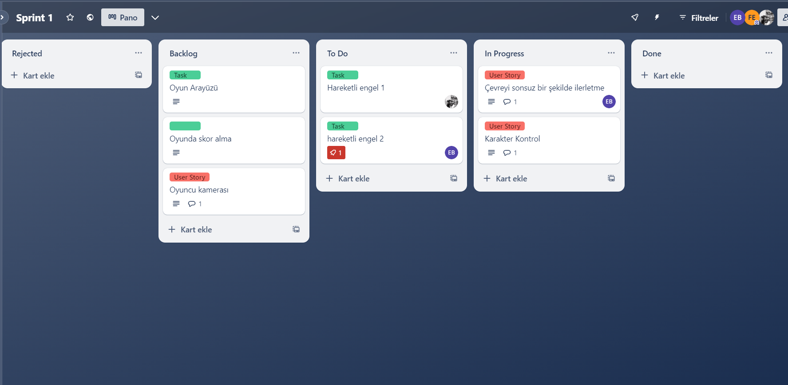

# Oyun ve Uygulama Akademisi Bootcamp 2024

## Takım İsmi

Unity 82

## Takım Üyeleri

| İsim | Rol |
|------|-----|
| Fatime Emin | Scrum Master |
| Etem Zemci Bildirici | Product Owner |
| Fahreddin Ekiz | Developer |
| Esra Uğurbaş | Developer |

# Oyun Bilgileri

## Dungeon Run

Gizemli ve büyülü bir zindanın derinliklerinde, antik bir hazineyi bulmak için cesur bir maceracı yola çıkar. Ancak bu zindan, sadece cesarete değil, aynı zamanda hıza ve çevikliğe de meydan okuyan tuzaklar ve engellerle doludur. Oyuncu, bu zorlu zindanın koridorlarında ilerlerken hem değerli hazineleri toplamaya çalışacak hem de ölümcül tuzaklardan kaçacak. Her bir adım, daha büyük tehlikeler ve daha büyük ödüller anlamına gelir. Dungeon Run'da, zindanın sırlarını keşfederken sınırlarınızı zorlayın ve tarihin derinliklerinde kaybolmuş bir efsane olun.

## Açıklama

Dungeon Run, tek oyunculu bir endless runner oyunudur. Karanlık ve tehlikelerle dolu zindanlarda geçen bu macerada, oyuncular karakterlerini yönlendirerek engellerden kaçmalı ve mümkün olduğunca ileri gitmelidir. Yol boyunca toplanan elmaslarla yeni karakterler açılabilir. Dungeon Run, mobil platformlar için özel olarak tasarlanmış ve her yaştan arcade oyun severlere hitap eden heyecan verici bir deneyim sunar.       

## Oyun Özellikleri

- 3D
- Mobil
- Endless runner
- Tek oyunculu
- Arcade
- Casual

## Oyun Detayları:

- Level Üretim Mantığı: Dungeon Run, procedural generation kullanarak her oynayışta benzersiz bir zindan yaratır. Karakter ilerledikçe yeni yollar üretilir ve geride kalan yollar otomatik olarak silinir. Bu sayede oyun, sonsuz bir şekilde ilerler.

- Karakter Kontrolü: Oyuncular, karakterlerini sağa, sola, yukarı ve aşağı kaydırma hareketleriyle kontrol eder. Engellerden kaçınmak ve elmas toplamak için hızlı refleksler gereklidir.

- Engeller ve Tuzaklar: Zindanın içinde oyuncuları bekleyen pek çok engel ve tuzak bulunur. Dikenli tuzaklar, sallanan baltalar ve açılıp kapanan kapaklar, oyuncuların dikkatli olmasını gerektirir. Engellere çarpmak, oyunun sona ermesine neden olur.

- Karakter Seçenekleri: Oyun boyunca toplanan elmaslarla yeni karakterler açılabilir.

## Hedef Kitle

- +7
- Mobil oyun sevenler
- Arcade oyun sevenler

- **Oyun APK linki:**
- **Kullanılan assetler:**
   
## Product Backlog URL

[Unity 82 Trello Board](https://trello.com/invite/u82backlogboard/ATTIb1399d66a6f99d4061eac73364982ba45D654F50)

# Sprint 1

- **Sprint Notları:** User story’ler product Backlog’ların içine yazılmıştır. Backlog item’lara tıklandığında hikayelerin ayrıntıları okunabilir.

- **Sprint içinde tamamlanması tahmin edilen puan:**  21 Puan

- **Puan tamamlama mantığı:** Proje boyunca tamamlanması tahmin edilen puan  54  olarak belirlenmiştir. Buna göre her sprint için en az 18 puan toplanması hedeflenmektedir.

- **Backlog düzeni ve story seçimleri:**  Product Backlog, oyunumuzun oluşması için gereken temel görevlere dayanarak düzenlenmiştir. Temel görevler için hikayeler oluşturulmuş ve task’lere bölünerek detaylandırılmıştır. Hikayeler puanlanırken Fibonacci dizisi kullanılmıştır ve en yüksek puanlı hikaye 13’ü geçmemektedir.

Trello'da kırmızı etiketli kartlar user story'leri, yeşil etiketli kartlar da task'leri temsil eder.

- **Daily Scrum:** Daily Scrum toplantıları Whatsapp üzerinden ilerletilmiştir. Buna ek olarak ekiple toplantı yapmak ve kaynak paylaşımı gibi konularda Discord Kullanılmıştır. [Daily Scrum](https://docs.google.com/document/d/154vns-skUWzITnW1tdjMHEg5iT2ei3CAXBMCkH5VuDk)
  
- **Sprint board update:** Sprint board screenshotları:

- **Ürün durumu:** Ekran Görüntüleri:

**Sprint review:**

- Level tasarımı için gereken çoğu görev tamamlandı.

- Karakter hareket mekaniği eklendi. Mobil entegrasyonu yapıldı.
  
- Coin ve sandık eklemenin 3. sprintte yapılmasına karar verildi. Puanlamada değişiklik yapılmasına karar verildi.
  
- Oyuna yeni hareketli ve sabit engeller eklenecek.

- Oyun arayüz tasarımı değiştirilecek.
  
- Sprint Review katılımcıları: Etem Zemci Bildirici, Fatime Emin, Fahreddin Ekiz 

**Sprint retrospective:**

- Daily scrum aktif olarak yapılacak. Herkes aldığı görevlerle ilgili günlük bilgilendirme yapacak.

- Takım üyelerinin gelecek sprintlerde aktif olması gerektiğine vurgu yapılmıştır.

# Sprint 2

- **Sprint içinde tamamlanması tahmin edilen puan:** 20

- **Daily Scrum:** Daily Scrum toplantıları Whatsapp üzerinden ilerletilmiştir. Buna ek olarak ekiple toplantı yapmak ve kaynak paylaşımı gibi konularda Discord Kullanılmıştır. [Daily Scrum](https://docs.google.com/document/d/1nPFootryK-KwlysL2jIznQ0j0XYLb53JrmNrgWhFyYE/edit)

- **Sprint board update:** Sprint board screenshotları:

- **Ürün durumu:** Ekran Görüntüleri:

**Sprint review:**

- Oyuna yeni engeller eklendi.

- Çevre tasarımı düzenlendi ve çevre sınırlandırıldı.

- Arayüz düzenlendi.

- Karakter modeli eklendi.

- Kaybetme ve oyuna yeniden başlama özelliği tamamlandı.

- Karakter animasyonları ve oyuncu bilgilerini kaydetme 3. Sprinte ertelendi.

- Sprint puanlamada değişiklik yapılmadı.

- Ödüllendirme için sandık yerine sadece coin eklenmesine karar verildi.

- Sprint Review katılımcıları: Etem Zemci Bildirici, Fatime Emin, Esra Uğurbaş

**Sprint retrospective:**

- Her gün için online görüşme yapılmasına karar verildi.

# Sprint 3

